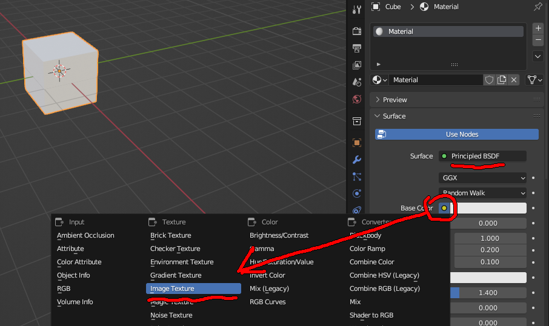
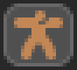
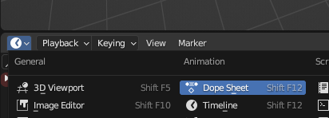
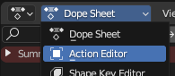

**setting up model:**

if u want textures to be included in your models, make sure its the default blender shader "principled BSDF" and put the texture in the "base color" property.

	this is because the parser only searches for the "pbrMetallicRoughness" property of a material
	
select a mesh, and go to the material tab on the right panel:
then click the circle left of the colour property and set it to "Image Texture" (this can also be done in the shader editor)



i havent set up a file having two armatures with different animations so u may need a new blender file for each object, something i have to think about for the future

the name of the `skinnedMesh` referenced in gamemaker is the name of the Armature:



the `mesh` names is the child of the orange triangle, the green triangle with the 3 vertices


i wont go into setting up an armature because theres already 100 tutorials on youtube
easiest way ive found to quickly do animations in blender is probably using **Actions**
change the bottom panel to dope sheet, and then select action editor:





each blender file should contain only one armature (i think, due to the way glTF exports all animations to the same skin?)

right now a `skinnedMesh` only knows about one armature and one mesh anything being animated should be joined together (Ctrl+J) before exporting (duplicate a collection as backup here as this is hard to undo)

---

**file exporting:**

check "remember export settings" so u dont have to do this every time for this file

format: glTF embedded (\*.gltf)

under "include" i just click visible objects that way u can uncheck unnecessary things like duplicate collections

	note: 'hidden/unlinked' animation actions may be included so good to clean those up. i dont know blender well enough

u can uncheck shape keys but it really doesnt matter
under animation, uncheck "sampling animations" i think it just bloats the file and i have no support for it

---

**in gamemaker:**

as a rule of thumb, loading the base file and standalone meshes are in `gltfScripts`, anything to do with bones or skinning is in `gltfSkinning`

to change the default test model, see `gltfSettings`

calling `gltfLoad(fname)` returns a struct of two arrays, `{skinnedMeshes[], meshes[]}` which contain the string names of. meshes and skins are stored in singleton functions and can be accessed with function like

`getMesh("MeshName", primitiveIndex) : vertex buffer`

`getMeshPrimitives("MeshName") : vertex buffer array`

`getSkin(name) : skin struct`

you can load more than one file but make sure they all have unique names for meshes and armatures to avoid overwriting a previous one

**MESHES**

meshes that are not skinned (not bound to a skeleton) are not instances and can simply be drawn using `drawMesh("meshName")`

meshes can contain multiple default textures, one for each material in blender. you can override them in an array (the second argument) eg `drawMesh("meshName", [ sprite_get_texture(sprCube, 0), ... , etc])`

i wrote a shortcut for drawing a mesh with a set of transforms:

`drawTransformed(px, py, pz, rot, scale, drawCode)`

this project was originally intended for a 2d side view to line up with gamemakers default room view

so `rot` is equivalent to `image_angle`

and `pz` is equivalent to `depth`

`drawCode` is a function. example use:

```
drawTransformed(x, y, z, 0, 10, function() {
	drawMesh("Cube");
`});
```

`drawTransformed3D()` has rotation in all 3 axes

**SKINS**

the default shader allows up to 24 bones, duplicate or change an existing shader to increase this. look for the `uBones[24]` in the vertex shader

`skinnedMeshes` are instances of structs, created using

`mySkin = new SkinnedMesh("ArmatureName");`

call either `.update()` or `.animate()` on this instance at least once before it can be drawn

`.update(_in=[])` sets the transform of all bones to 0 by default (eg tpose), but u can pass in an array of transform matrices to the first argument for procedural animations (array position=bone index)

`.getBoneIndex(boneName="Root")`

`.setAnimation("AnimationName")` sets which corresponding blender action the mesh is doing

`.animate(t)` sets the transform of the bones based on the current animation at time `t` (in seconds), time automatically wraps around if a value is too large or small

`.getAnimationLength(animName=currentAnimation)` gets the duration (in seconds) of the current animation if you want finer countrol

`.setTexture(index, texture, uvs=[0,0,1,1])` allows you to change individual textures on a skinnedMesh instance

`.draw()` draws a skinned mesh with the default shader

`.draw(shader=shSkinnedMesh, uniforms=[])` sets a custom shader. if the shader has extra uniforms i have data structures for those in the `shaderHelpers` script, `shaderUniformFloat` (for float-vec4) and `shaderUniformSampler` (for textures)

this shader should have bone weights and indices, and a uniform for the bones called `uBones` which is always passed in. if in doubt, duplicate `shSkinnedMesh` first

`.getSize()` size of AABB of min and max vertex coordinate values, ignoring any transformations

`.getBoneRestPose(boneIndex)`

`.getBoneLocalTransformMatrix(boneIndex)`

`.getBoneModelTransformMatrix(boneIndex)`

`.debugDrawBones()`

---

**animation blending**

for playing two animations at once eg moving and talking at the same time

i havent set it up properly yet but heres an example:

```
var a1 = testSkin.skin.animate(t, "walk");
var a2 = testSkin.skin.animate(t, "headbang");
var blended = testSkin.blendAnimation(a1, a2, 0.5);
testSkin.animateBlended(blended);
```

for more than two animations, you can use `blended` as a parameter for `blendAnimation`, as `a1, a2, blended` are all instances of `poseTriple`

if two animations work on completely different bones, they will treat the weight for their respective bones as being "1". only bones that are referenced by both animations will blend together with the given amount.

---

**TODO:**

`shSkinnedMeshLit`
	shader that incorporates gamemakers built in lighting uniforms
